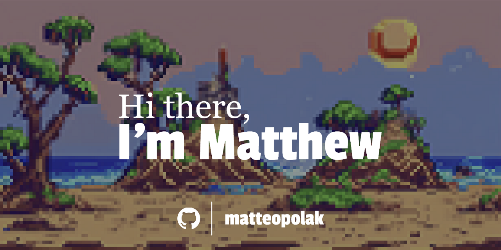

- 🔭 I’m currently working on **[matchmaker](https://github.com/matteopolak/matchmaker)**
- 🌱 I’m currently learning **Flutter 🐦**
- 💬 Ask me for my résumé!
- 📫 How to reach me:
  - **[@matteo-polak](https://linkedin.com/in/matteo-polak)** on LinkedIn 💼
  - Send an e-mail to **[contact@matteopolak.com](mailto:contact@matteopolak.com)**

🌟 **Achievements**

- 2022 Skills Ontario Coding Competition Winner
- 2023 **[HackTheHill](https://hack-the-hill.devpost.com/)** Hackathon
  - 1st Place (Ciena track)
  - Best Developer Experience
  - Best Cybersecurity Project
- 2023 **[MLH x {all in}](https://all-in-hackathon.devpost.com/)** Hackathon
  - 1st Place
- 2023 **[MapHacks 2](https://maphacks-2.devpost.com/)** Hackathon
  - 1st Place
  - Best Sustainable Travel Hack
